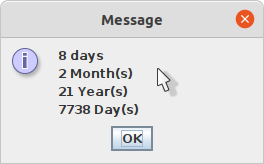

# Date-Counter

> Find the difference between two dates.


## Fileds
* Start Date:
  * Entre the Date you want to count from.
* End Date:
  * Entre the date you want to count till.

## Buttons
* Count:
  * Counts the difference between the dates. 
 



## Running Program

OS X & Linux terminal:

```sh
javac *.java
java DateFrameViewer
```

Windows cmd:

```sh
javac DateCounterPanel.java DateFrameViewer.java DateVerifier.java
java DateFrameViewer
```
